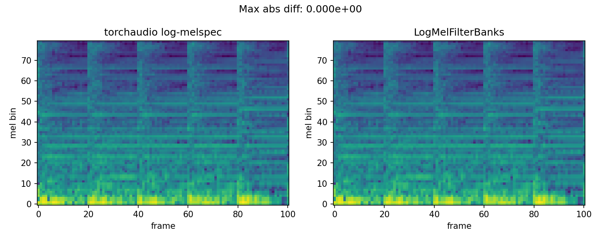
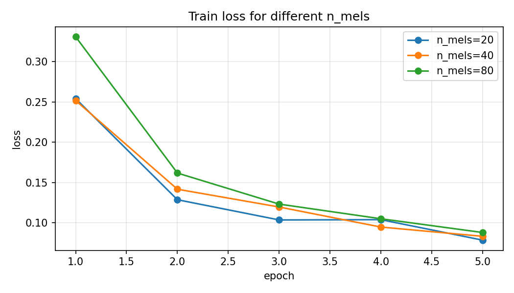
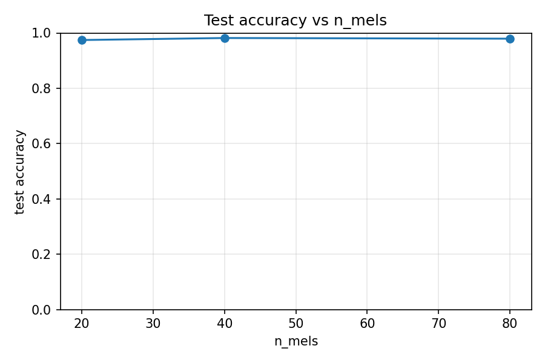
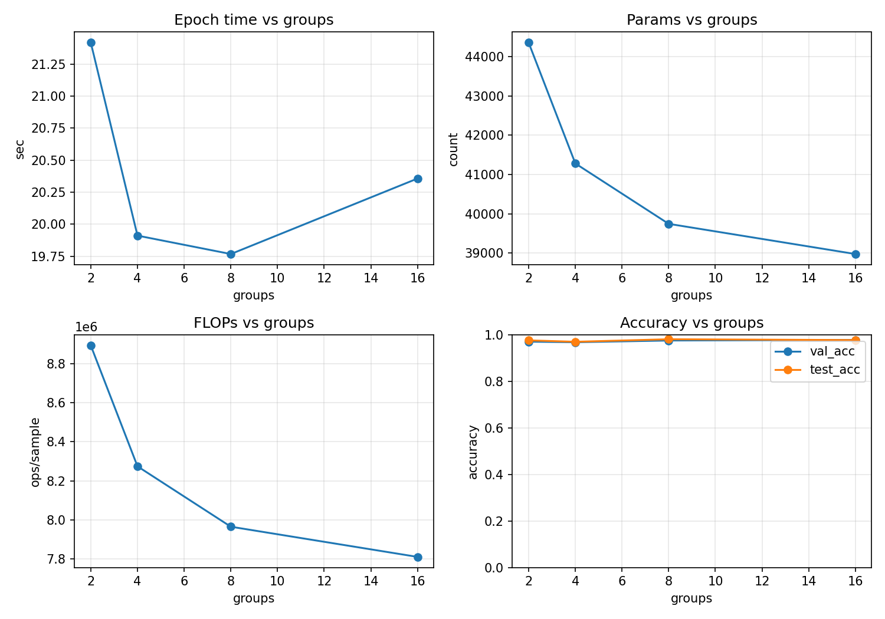

# Assignment 1 Report

## 1. Что было сделано

1. Реализован слой `LogMelFilterBanks` в `melbanks.py`.
2. Добавлена проверка корректности относительно `torchaudio.transforms.MelSpectrogram`.
3. Реализован пайплайн обучения в `train_pipeline.py`:
- загрузка `SPEECHCOMMANDS`;
- фильтрация только классов `yes/no`;
- обучение небольшой `Conv1d` модели (`TinyKWS`);
- логирование `train_loss`, `val_acc`, `test_acc`, времени эпохи, числа параметров и FLOPs.
4. Выполнены эксперименты:
- по числу мел-фильтров `n_mels = {20, 40, 80}`;
- по `groups` в `Conv1d`: `groups = {2, 4, 8, 16}`.
5. Получены графики и CSV-таблицы с результатами.

## 2. Результаты: влияние `n_mels`

| n_mels | Params | FLOPs | Avg epoch time (s) | Final val acc | Test acc |
|---|---:|---:|---:|---:|---:|
| 20 | 31,298 | 6,257,408 | 21.14 | 0.9788 | 0.9745 |
| 40 | 37,698 | 7,550,208 | 20.65 | 0.9714 | 0.9818 |
| 80 | 50,498 | 10,135,808 | 20.70 | 0.9776 | 0.9794 |

Краткий вывод: на моем запуске лучший `test_acc` получился при `n_mels=40`, при этом рост `n_mels` увеличивает параметры и FLOPs.

## 3. Результаты: влияние `groups` (при `n_mels=80`)

| groups | Params | FLOPs | Avg epoch time (s) | Final val acc | Test acc |
|---|---:|---:|---:|---:|---:|
| 2  | 44,354 | 8,894,720 | 21.42 | 0.9714 | 0.9769 |
| 4  | 41,282 | 8,274,176 | 19.91 | 0.9689 | 0.9709 |
| 8  | 39,746 | 7,963,904 | 19.77 | 0.9763 | 0.9818 |
| 16 | 38,978 | 7,808,768 | 20.36 | 0.9788 | 0.9782 |

Краткий вывод: увеличение `groups` уменьшает число параметров и FLOPs. В моем эксперименте лучший `test_acc` среди этих значений получился при `groups=8`.

## 4. Артефакты

Сгенерированы файлы:
- `outputs/logmel_reference_compare.png`
- `outputs/n_mels_results.csv`
- `outputs/n_mels_train_loss.png`
- `outputs/n_mels_test_accuracy.png`
- `outputs/groups_results.csv`
- `outputs/groups_metrics.png`

## 5. Графики и визуализации

### Сравнение `LogMelFilterBanks` и `torchaudio`

### Эксперименты по `n_mels`

### Эксперименты по `groups`

## 6. Выводы по экспериментам

1. По серии `n_mels = {20, 40, 80}`:
- точность на тесте выросла при переходе от 20 к 40 (`0.9745 -> 0.9818`) и немного снизилась на 80 (`0.9794`);
- `params` и `FLOPs` растут почти линейно с `n_mels` (от 31,298 и 6.26M до 50,498 и 10.14M);
- время эпохи изменилось слабо (около 20-21 секунд), то есть основная цена роста `n_mels` здесь именно в сложности модели, а не в заметном ускорении/замедлении.

2. По серии `groups = {2, 4, 8, 16}` (при `n_mels=80`):
- увеличение `groups` действительно уменьшает `params` и `FLOPs` (44,354 -> 38,978 и 8.89M -> 7.81M);
- по времени эпохи лучший результат в этом запуске у `groups=8` (~19.77s);
- по качеству нет деградации при умеренном увеличении `groups`: лучший `test_acc` получился у `groups=8` (`0.9818`), а у `groups=16` качество осталось близким (`0.9782`).

3. Практический итог:
- для этого задания удачным компромиссом выглядит `groups=8` (лучший test accuracy среди group-экспериментов и меньше вычислений, чем при `groups=2`);
- по `n_mels` наиболее эффективным по соотношению качество/сложность в моем запуске оказался `n_mels=40`.

4. Ограничение интерпретации:
- серия `groups` запускалась при фиксированном `n_mels=80`, поэтому итоговые выводы по `groups` и `n_mels` сделаны как отдельные сравнения, а не как полный перебор всех пар параметров.
